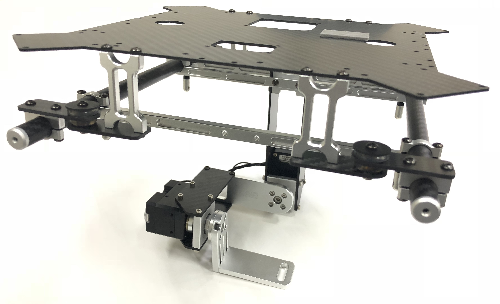
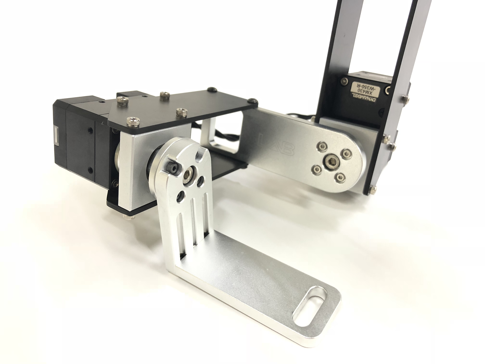
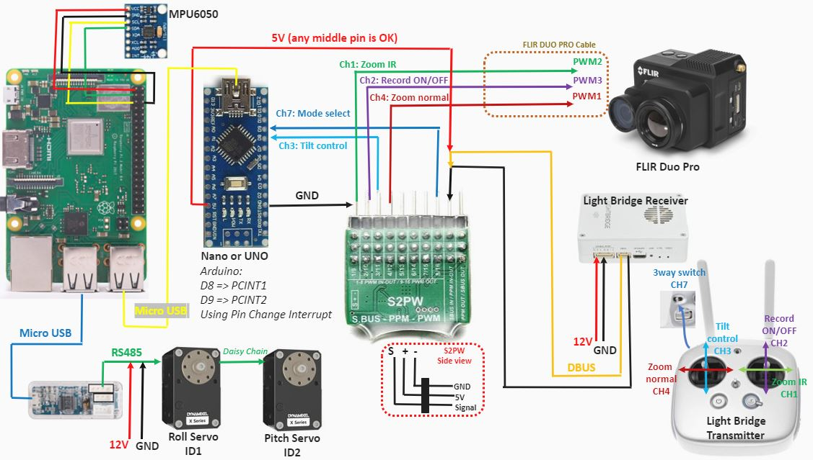

# DynamixelServoGimbal
A custom design of 2 axes UAV gimbal (roll and pitch) by using Dynamixel XM430-W350-R servos and controlling the tilt angle from DJI LightBridge. The gimbal platform was specifically designed for FLIR Duo Pro camera, but it can be modified to other similar size of camera.





# Hardware
This project includes:
1. Dynamixel XM430-W350-R x2
2. Dynamixel U2D2 USB converter
3. Raspberry Pi
4. Arduino UNO or Nano
5. MPU6050
6. S2PW SBUS to PWM converter
7. LightBridge Receiver,Transmitter
8. Power supply of 5V and 12V
9. Camera

You can find a wiring diagram down here.



# How it works...
Due to the Dynamixel servo has an SDK in Python, so this project we use a RPi as main controller to implement the control program. A RPi can communicate wtih Dynamixel servo using U2D2 usb conveter and interface with MPU6050 via i2c. To control the servo from LightBridge transmiiter, we use S2PW to convert DBUS signal to PWM signal for each channel and connect it to Arduino at pin 8 and 9. An Arduino sends serial data via usb to RPi and use in control program. On the LightBridge transmitter, it has 3 way switch which be used as mode selection 1. Horizontal view stabilizer (Default) 2. Stabilized Roll and manual tilt control 3. Holding tilt angle from 2 and stabilize both angle. Zoom and recording are controlled directly by sending PWM signal from transmitter to camera cable, don't need to pass an Arduino or RPI.

---

## TestReceiverInterrupt Arduino Sketch

To read the PWM signal with efficient way and reduce time, I suggest to use interrupt to detect incoming pwm signal. This video from 
Kamran Ahmad was well explained how to read pwm signal using interrupt in Arduino.
https://www.youtube.com/watch?v=6rZ14KxvPsk&list=LL3Z_DCfdbL7I5nZqf8ezejQ&index=18&t=0s
https://www.youtube.com/watch?v=IgYrztplkwU&list=LL3Z_DCfdbL7I5nZqf8ezejQ&index=17&t=0s

---

## 2AxesDynamixelServoGimbal Python Script

To run this script, you may need to install mpu6050 and dynamixel_sdk library or copy both floder to the same direction as python scirpt. 

We made two threads for 1. reading serial from arduino and 2. stabilize the camera with servo. After initialization of port handler from dynamixel servo works, we start set profile velocity and servo pid. Then turn on the torque and let the servo move to home position as horizontal view poiting.

```
SetProfile1(0,0)
SetProfile2(0,0)
SetPID1(800,1000,0)
SetPID2(800,1000,0)
time.sleep(0.5)

TorqueOn()
time.sleep(0.5)
GoHome12()
time.sleep(2)
```
After that, we set `ser` to connect serial between RPi and Arduino. Doing some calibration of gyroscope in mpu6050, and after that make a semaphore `sem = threading.Semaphore()` to protect shared variable between two threads. 

### ReadSerial() Thread
Data from `ser` will be stored in `data = ser.readline()` then it will be splitted as character as `DATA = list(data)`. The idea is to make sure that the length of data still 11 all the time. If there is some missing data the length will be lower and we consider it as Trash Data. The length of 11 comes from 
```
DataCh1 = [DATA[0],DATA[1],DATA[2],DATA[3]]
DataCh2 = [DATA[5],DATA[6],DATA[7],DATA[8]]
```
DATA[4] is `,`, which is useless. DATA[9] and DATA[10] are `\r` and `\n`, which is also useless. So totally, the data will always sends 11 characters, and we use just `DataCh1` and `DataCh2`. Then, to make sure again that DataCh1 and DataCh2 are number not unknown character, we set some condition to check that. After we got useful data, semaphore was used to secure the data between threads.
```
sem.acquire()
mode=switch
tilt=control_ang
sem.release()
```
This thread is shown here
```
def ReadSerial():
    global mode, tilt
    data=[]
    while 1:
        data = ser.readline()
        DATA = list(data)

        if len(DATA) == 11:
            DataCh1 = [DATA[0],DATA[1],DATA[2],DATA[3]]
            DataCh2 = [DATA[5],DATA[6],DATA[7],DATA[8]]
            Ch1 = "".join(DataCh1)
            Ch2 = "".join(DataCh2)
            if Ch1.isdigit() and Ch2.isdigit():
                stick = int(Ch1)
                switch = int(Ch2)
                control_ang = map(stick,1088,1920,-1.0,1.0)
                #We write in the variable protected with a semaphore
                sem.acquire()
                mode=switch
                tilt=control_ang
                sem.release()
            else:
                print("NA")            
        else:
            print ("Trash Data")
```
### RunGimbal() Thread

The gimbal thread starts with getting variables from ReadSerial between semaphore
```
sem.acquire()
print("update Value")
modeRun=mode
tiltRun=tilt
sem.release()
```
then getting angle data from `rollDegree, pitchDegree = getIMU3(period)`. After that, it needs to check the mode `modeRun` from serial data. The idea of stabilize the camera is to compensate the angle of UAV, so when MPU6050 that attached on UAV platform turns to some angle, roll and pitch servo should be able to compensate that angle back to desired position.
```
        if modeRun < 1200:
            #rollDegree, pitchDegree = getIMU3()
            ServoAng1 = normal_roll - rollDegree 
            ServoAng2 = normal_pitch - pitchDegree
        ## Tilt manual control
        elif modeRun > 1400 and modeRun < 1550:
            ServoAng1 = normal_roll - rollDegree 
            ServoAng2 = normal_pitch + (80*tiltRun)
            # Set new pitch angle
            new_pitch = normal_pitch + (80*tiltRun)
        ## Use new pitch angle on stabilize mode
        elif modeRun > 1800:
            #rollDegree, pitchDegree = getIMU3()
            ServoAng1 = normal_roll - rollDegree 
            ServoAng2 = new_pitch - pitchDegree
 ```
 After get the servo angle in each condition or mode, we use servo function `RunServo(ServoAng1,ServoAng2)` to drive each servo.
 
 To make those thread works, at the end of the scritp, we just make a threading and start as shown here
 ```
 #Start the thread
try:
   t1= threading.Thread(target = ReadSerial)
   t2 = threading.Thread(target = RunGimbal)
   t1.start()
   t2.start()

except:
   print("Error: unable to start thread")

while 1:
    pass
```
